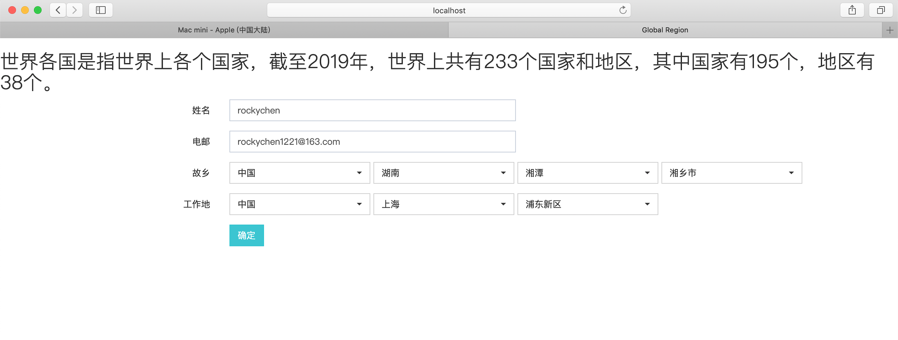
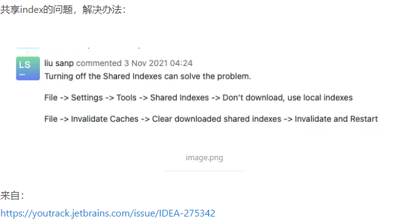
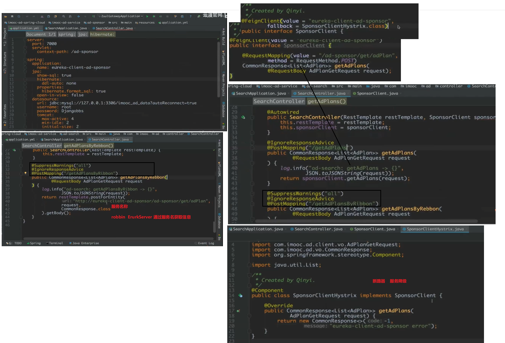
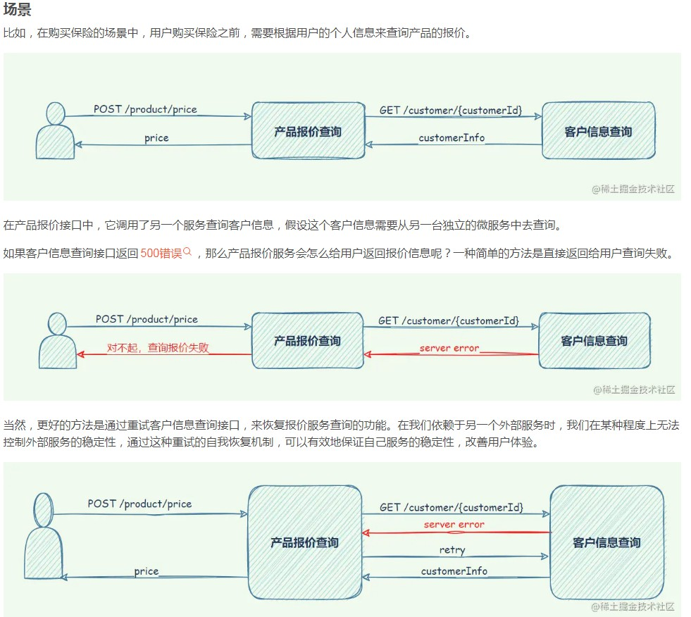
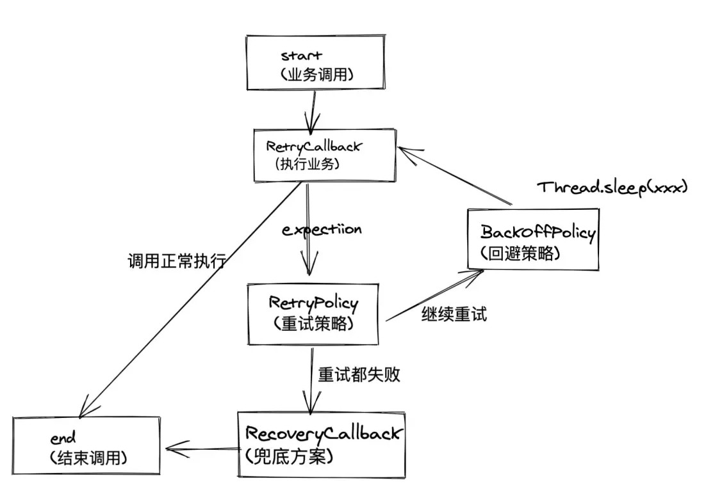
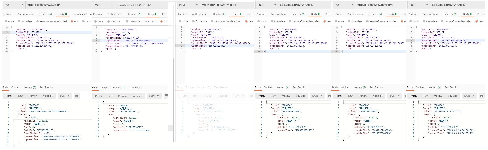

[](https://github.com/rockychen1221/GlobalRegion/blob/master/LICENSE)
[](https://gitee.com/rockychen121/GlobalRegion)

# GlobalRegion 简介

世界各国是指世界上各个国家，截至2019年，世界上共有233个国家和地区，其中国家有195个，地区有38个。

数据较全，体验较好，支持快速接入，根据上级查找附属直接下级，支持检索以及默认值初始化赋值（本example默认：中国/湖南/湘潭/湘乡市）

支持中英文国际化，通过[pinyin4j-example](https://github.com/rockychen1221/pinyin4j-example)获取地区数据国际化

级联格式依次为：国家（地区）/省份（直辖市）/市（区）/县，效果如图



## 本实例依赖以下插件或库，可根据实际使用进行调整修改

* jQuery
* BootStrap 3
* BootStrap Select

> 考虑到同一个页面会有多个地区应用场景，比如故乡和工作地，故Ajax请求发送设置为同步，可根据需要调整

## 如何运行

* ~~Step 1. 在您的数据库中执行`sql`目录中的脚本，`d_area`为地区层级，`sys_lang`为国际化，更换应用数据库连接信息~~
* Step 1. 使用`mvn spring-boot:run`,启动后浏览器访问`http://localhost:8080`

## 如何接入使用

* Step 1. 自定义地区下拉元素页面布局，根据实际页面比例预留长度，声明下拉元素ID（需在Step 3 初始化传入，如使用默认ID:fromArea，即可不传）
* Step 2. 在您自己的页面引入`area.js`
* Step 3. 调用`Area.initFromArea();` ,初始化即可接入使用

## Update...

* 加入h2内存数据库，去除mysql依赖，
* 添加单元测试
* 优化部分代码
* 同步Gitee

## 如果对您有帮助节省了您的时间，请Star支持，数据欢迎补充维护

## Next

- [ ] 目前脚本查询到的一级国家/地区共有240个，哪多冒出来7个。。。需要进行核对，和外交部一致
- [ ] 封装成Vue组件
- [ ] 将地区数据做成地图图表，支持下钻

多库提交： git push origin && git push gitee

## 数据库脚本

```sql
create table person
(
    id bigint primary key auto_increment comment '主键',
    code varchar(50) comment '学号',
    name varchar(50) comment '姓名',
    -- 
    sex tinyint comment '性别',
    age smallint comment '年龄',
    political varchar(50) comment '政治面貌',
    origin varchar(50) comment '籍贯',
    professional varchar(50) comment '所属院系'
) engine=innodb charset=utf8mb4 comment '人员表';
```

springboot 判断环境
https://blog.csdn.net/qq_41633199/article/details/107366728
https://www.zhangshilong.cn/work/270539.html
https://blog.csdn.net/qq_27818541/article/details/105719962

读取maven 环境
https://blog.csdn.net/ityqing/article/details/97780578
https://www.cnblogs.com/expiator/p/9724540.html
https://blog.csdn.net/qq_27818541/article/details/105719962
https://www.likecs.com/show-204465189.html
https://blog.csdn.net/qq_41633199/article/details/107366728

?useUnicode=true&characterEncoding=UTF-8&serverTimezone=UTC
https://www.cnblogs.com/EasonJim/p/6906713.html
https://www.cnblogs.com/godwithus/p/9788790.html

执行代码 java -jar target\global-area-0.0.1-SNAPSHOT.jar --spring.profiles.active=prod --girl.cupsize=M java -jar
-Dspring.profiles.active=prod global-area-0.0.1-SNAPSHOT.jar --server.address=0.0.0.0 nohup java -jar
-Dspring.profiles.active=prod global-area-0.0.1-SNAPSHOT.jar & nohup java -jar -Dspring.profiles.active=prod
/usr/local/softs/wars/global-area-0.0.1-SNAPSHOT.jar > /dev/null 2>&1 &

```
不添加  --server.address=0.0.0.0 只能本机访问，因为 server.address=127.0.0.1
redis有类似的概念
bind 127.0.0.1
备注：如果想要设置指定IP连接redis，只需要修改redis.conf文件中bind配置项即可。如果不限IP，将127.0.0.1修改成0.0.0.0即可。
https://www.cnblogs.com/jiangcong/p/15449452.html

解决nohup: 忽略输入并把输出追加到"nohup.out"或者nohup: 忽略输入重定向错误到标准输出端

解决方法：

执行nohup java -jar do_iptable.jar & 运行jar会提示：nohup: 忽略输入并把输出追加到"nohup.out"

执行nohup java -jar do_iptable.jar >/dev/null & 运行jar会提示：nohup: 忽略输入重定向错误到标准输出端

修改运行方式为：

nohup java -jar 你的springboot工程名称.jar --server.port=端口号 do_iptable.jar >/dev/null 2>&1& 即可。
————————————————
版权声明：本文为CSDN博主「你挚爱的强哥」的原创文章，遵循CC 4.0 BY-SA版权协议，转载请附上原文出处链接及本声明。
原文链接：https://blog.csdn.net/qq_37860634/article/details/87485070
```

springboot 启动慢
https://blog.csdn.net/wyyl1/article/details/84785237
service network restart # 保存后，重启网络： 127.0.0.1 localhost aoedeMacBook-Pro.local
::1 localhost aoedeMacBook-Pro.local

jedis

```bash
maven使用本地jar包
maven依赖：
<dependency>
    <groupId>redis.clients</groupId>
    <artifactId>jedis</artifactId>
    <version>2.9.0</version>
</dependency>
对应于：

mvn install:install-file -Dfile=jedis-2.9.0.jar -DgroupId=redis.clients -DartifactId=jedis -Dversion=2.9.0 -Dpackaging=jar
文件名：jedis-2.9.0.jar （注意路径）
groupId：redis.clients
artifactid：jedis 
version：2.9.0
```

spring容器

```
// 从spring容器中获取对象
// https://www.zhangshengrong.com/p/v710KZWrXM/
https://blog.csdn.net/qq_40965479/article/details/127431468

```

集合

```
集合交集,并集,交集
https://www.jianshu.com/p/99447a48c28f
listA.retainAll(listB); // 交集: A 交 B
listA.removeAll(listB);  // 差集: A - B
listA.addAll(listB);     // 并集 A 并 B 不去重

listA.removeAll(listB); // 并集去重
listA.addAll(listB);

https://www.tabnine.com/code/java/methods/java.util.stream.Collectors/toMap

```

正则表达式

```
[A-F]{4}(?!\S)
https://rubular.com/r/lvpbG4nAYG
https://regex101.com/r/uU8gF5/2
https://www.regexplanet.com/advanced/java/index.html

```

Excle

```
https://www.cnblogs.com/tobiasy/p/16205868.html
https://stackoverflow.com/questions/71970035/java-lang-nosuchmethoderror-org-apache-logging-log4j-logger-atdebug-with-poi
The spring-boot-starter version 2.2.0 dependency was bringing log4j related dependencies with 2.12.1 version, which, did not have atDebug() method. So:
<dependencyManagement>
        <dependencies>
            <!-- https://mvnrepository.com/artifact/org.apache.logging.log4j/log4j-to-slf4j -->
            <dependency>
                <groupId>org.apache.logging.log4j</groupId>
                <artifactId>log4j-to-slf4j</artifactId>
                <version>2.17.2</version>
            </dependency>

            <!-- https://mvnrepository.com/artifact/org.apache.logging.log4j/log4j-api -->
            <dependency>
                <groupId>org.apache.logging.log4j</groupId>
                <artifactId>log4j-api</artifactId>
                <version>2.17.2</version>
            </dependency>
        </dependencies>
    </dependencyManagement>
```

git

```bash
git config --list | grep alias
cat ~/.gitconfig


可以在~/.zshrc 文件中定义别名，下面是定义的别名。这时使用 gp 将同时提供到 github 与 gitee
alias gp="git push & git push github"

cat .git/config
git config  alias.push "push origin & git push gitee" 
https://segmentfault.com/a/1190000038583946
https://www.itqaq.com/index/322.html

git reset HEAD -- . 撤销暂存区的文件
git reset --hard 清空工作区和暂存区的改动

在撤销修改一节中，我们知道，命令git reset HEAD file可以把暂存区的修改撤销掉（unstage），重新放回工作区。既然是一个unstage操作，就可以配置一个unstage别名：
$ git config --global alias.unstage 'reset HEAD'


git restore .
git checkout .
git clean -n

```

json转换

```
https://blog.csdn.net/C_H_K/article/details/79530590
https://www.devler.cn/blog/295
https://blog.csdn.net/C_H_K/article/details/79530590
https://www.cnblogs.com/jokerjason/p/5724493.html
gson
https://www.cnblogs.com/nxf-rabbit75/p/15824987.html

https://www.cnblogs.com/niudaben/p/13229970.html
https://www.cnblogs.com/niudaben/p/13229970.html
JSON.toJSONStringWithDateFormat(Object,dateformat,SerializerFeature.WriteDateUseDateFormat)
JSON.toJSONStringWithDateFormat(map, "yyyy-MM-dd HH:mm:ss", SerializerFeature.WriteDateUseDateFormat);


```

```
maven 
chenlangping.me/2021/01/16/日常解惑-IDEA读取pom文件卡死问题/
阿里云仓库地址
https://maven.aliyun.com/repository/public
https://maven.aliyun.com/nexus/content/groups/public/
https://www.jianshu.com/p/f265397618eb

```

maven问题


## 问题

```
SpringBoot启动时报错：The bean 'dataSource', defined in BeanDefinition defined in class path resource
https://www.cnblogs.com/sunny3158/p/16653596.html


```

## spring cloud

```
springboot springcloud版本对应
https://www.cnblogs.com/joshua317/p/15302934.html
https://www.cnblogs.com/myitnews/p/12388581.html
https://blog.csdn.net/wjg1314521/article/details/105052679/


```

```
单元测试
https://www.jianshu.com/p/2870b31e2996
https://www.cnblogs.com/Lyn4ever/p/12764875.html
```

## openfeign

```
Feign是一个声明式的伪Http客户端，它使得写Http客户端变得更简单。使用Feign，只需要创建一个接口并注解。它具有可插拔的注解特性，可使用Feign 注解和JAX-RS注解。Feign支持可插拔的编码器和解码器。Feign默认集成了Ribbon，并和Eureka结合，默认实现了负载均衡的效果。
https://blog.csdn.net/qq_18671415/article/details/111867607
参考代码下载：https://github.com/xjs1919/enumdemo下面的openfeign/feign-boot。

怎样学习openfeign  http://185.232.92.110:9880/
1、首先了解OpenFeign的基本概念，了解它的功能和优势；
2、学习OpenFeign的安装和配置，了解如何使用它；
3、学习OpenFeign的API，了解如何使用它来实现RESTful服务；
4、学习OpenFeign的客户端实现，了解如何使用它来实现客户端调用；
5、学习OpenFeign的服务端实现，了解如何使用它来实现服务端调用；
6、学习OpenFeign的高级特性，了解如何使用它来实现更多的功能；
7、学习OpenFeign的实践案例，了解如何使用它来实现实际的应用场景。

```

### 一、简介

OpenFeign是一个声明式的Web服务客户端，它使得编写Web服务客户端变得更加简单。使用Feign，只需要创建一个接口并注解，即可完成对服务提供方的接口绑定，简化了使用Spring Cloud
Ribbon时，自动封装服务调用客户端的开发量。

### 二、案例

#### 1. 创建工程

创建一个Spring Boot工程，并引入依赖：

```xml

<dependencies>
    <dependency>
        <groupId>org.springframework.cloud</groupId>
        <artifactId>spring-cloud-starter-openfeign</artifactId>
        <version>2.0.0.RELEASE</version>
    </dependency>
    <dependency>
        <groupId>org.springframework.cloud</groupId>
        <artifactId>spring-cloud-dependencies</artifactId>
        <version>Greenwich.SR2</version>
        <!--<version>Finchley.RELEASE</version>-->
        <!--<version>${spring-cloud.version}</version>-->
        <!--<spring-cloud.version>Finchley.RELEASE</spring-cloud.version>-->

        <type>pom</type>
        <scope>import</scope>
    </dependency>
</dependencies>
```

#### 2. 创建接口

创建一个接口，并使用Feign注解：

```java

@FeignClient(value = "eureka-client")
public interface EurekaClientFeign {
    @GetMapping(value = "/dc")
    String consumer();
}
```

#### 3. 创建控制器

创建一个控制器，并使用Feign接口：

```java

@RestController
public class DcController {
    @Autowired
    EurekaClientFeign eurekaClientFeign;
    
    @GetMapping("/consumer")
    public String dc() {
        return eurekaClientFeign.consumer();
    }
}
```

#### 4. 启动工程

启动工程，访问`http://localhost:8080/consumer`，可以看到返回结果：`Hello World`。

https://blog.csdn.net/qq_18671415/article/details/111867607
https://github1s.com/xjs1919/enumdemo/blob/master/openfeign/feign-boot/feign-server/src/main/java/com/github/xjs/openfeign/boot/server/controller/ServerDemoController.java#L8-L16


## 远程调用



## 重试




## jackjson Date 

```

http://localhost:8080/test/body1
http://localhost:8080/lyy/body1

{
    "mobile": "13718526927",
    "schoolId": 331122,
    "name": "曾阿牛",
    "createTime": "2023-4-18",
    "updateTime": "2011-11-18 09:29:45",
    "createTime3": "2021-04-11T01:45:13.407+0000",
    "updateTime5": 1883234239339,
    "sex": 1
}

```




```java
               
```